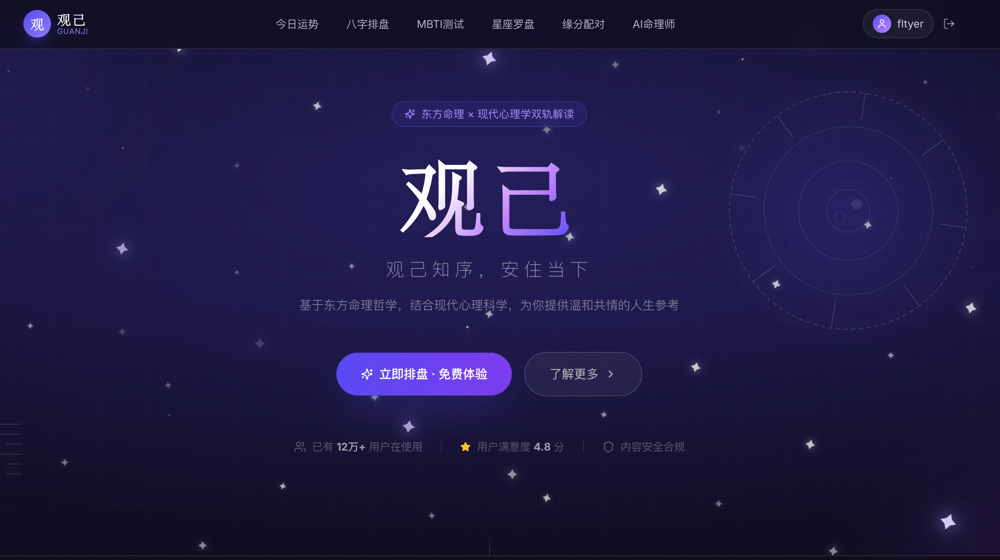

# 观己 · Guanji

> 观己知命，顺势而为

融合东方命理哲学与现代心理科学的 AI 占卜 SaaS 平台，基于 DeepSeek 大模型提供八字排盘、每日运势、MBTI 测试、星座罗盘和 AI 命理师对话服务。



---


## 目录

- [功能特性](#功能特性)
- [技术栈](#技术栈)
- [项目结构](#项目结构)
- [快速开始](#快速开始)
- [环境变量](#环境变量)
- [数据库初始化](#数据库初始化)
- [API 文档](#api-文档)
- [会员体系](#会员体系)
- [部署](#部署)

---

## 功能特性

### 核心模块

| 模块 | 路由 | 描述 |
|------|------|------|
| 每日运势 | `/fortune` | 基于今日干支由 AI 生成全局缓存运势，含事业、财运、感情、健康四维解读 |
| 八字排盘 | `/bazi` | 输入生辰八字，AI 给出四柱、日主、五行平衡度及命盘分析，支持农历/公历 |
| MBTI 测试 | `/mbti` | 60 道题测出 16 种人格类型，并与五行体系融合解读 |
| 星座罗盘 | `/zodiac` | 12 星座每日运势，星座与五行互相印证 |
| AI 命理师 | `/ai-chat` | 与 AI 命理师「玄机」深度对话，结合个人命盘做个性化解读 |
| 个人档案 | `/profile` | 管理账号信息、查看八字历史、追踪 AI 对话配额 |
| 会员中心 | `/membership` | 订阅基础版或专业版，解锁更多对话次数和高级功能 |

### 核心技术亮点

- **AI 驱动**：所有命理内容均由 DeepSeek API 实时生成，非静态数据
- **智能缓存**：运势类内容全局缓存（TTL 2 天），避免重复 AI 调用
- **配额管理**：数据库行锁原子性扣减对话次数，防并发超扣，调用失败自动退款
- **多端认证**：支持 GitHub OAuth、Google OAuth 和邮箱密码注册/登录
- **合规内容**：违禁词过滤、合规声明底栏、AI 输出末尾自动追加娱乐免责声明

---

## 技术栈

| 层级 | 技术 |
|------|------|
| **框架** | [Next.js 14](https://nextjs.org/) (App Router) |
| **语言** | TypeScript |
| **样式** | Tailwind CSS + 自定义 CSS 动画 |
| **状态管理** | [Zustand](https://github.com/pmndrs/zustand) + localStorage 持久化 |
| **认证** | [NextAuth.js v4](https://next-auth.js.org/) |
| **数据库** | [Supabase](https://supabase.com/) (PostgreSQL + RLS) |
| **AI** | [DeepSeek API](https://www.deepseek.com/) (`deepseek-chat` 模型) |
| **图标** | [Lucide React](https://lucide.dev/) |
| **部署** | [Vercel](https://vercel.com/) |

---

## 项目结构

```
src/
├── app/
│   ├── (auth)/              # 认证路由组
│   │   └── login/
│   ├── (chat)/              # AI 对话路由组（无 Footer/ComplianceBar）
│   │   └── ai-chat/
│   ├── (main)/              # 主功能路由组
│   │   ├── page.tsx         # 首页
│   │   ├── bazi/            # 八字排盘
│   │   ├── fortune/         # 每日运势
│   │   ├── mbti/            # MBTI 测试
│   │   ├── zodiac/          # 星座罗盘
│   │   ├── profile/         # 个人档案
│   │   └── membership/      # 会员套餐
│   └── api/
│       ├── auth/            # NextAuth 端点 + 注册
│       ├── bazi/            # 八字排盘 & 历史
│       ├── chat/            # AI 对话（含配额管理）
│       ├── fortune/         # 每日运势缓存
│       ├── mbti/            # MBTI 计算与保存
│       ├── zodiac/          # 星座运势缓存
│       └── user/            # 用户信息 & 配额查询
├── components/
│   ├── layout/              # Navbar, Footer, ComplianceBar, StarField
│   ├── ai-chat/             # ChatInput, ChatMessage
│   ├── bazi/                # BaziForm, BaziChart, PosterPreviewModal
│   ├── mbti/                # MbtiProgress, MbtiQuestionCard, MbtiResultDisplay
│   ├── zodiac/              # ZodiacCompass, ZodiacFortunePanel
│   └── ui/                  # Button, Card, Input, Badge 基础组件
├── lib/
│   ├── auth.ts              # NextAuth 配置
│   ├── supabase.ts          # Supabase 多端客户端
│   ├── constants.ts         # 全局常量（导航、配额、违禁词、五行映射）
│   ├── db/                  # 数据库操作层（users, bazi, chat, fortune, mbti, zodiac）
│   ├── data/                # 静态数据（mbtiQuestions, zodiacData）
│   └── utils/               # 工具函数
├── store/
│   ├── useUserStore.ts      # 用户全局状态
│   ├── useMbtiStore.ts      # MBTI 测试进度
│   └── useBaziStore.ts      # 八字排盘状态
├── types/
│   └── index.ts             # 全局 TypeScript 类型定义
└── middleware.ts             # 路由保护（未登录跳转 /login）

supabase/
└── schema.sql               # 完整数据库 Schema（表、索引、RLS、函数、初始数据）
```

---

## 快速开始

### 前置要求

- Node.js 18+
- npm / yarn / pnpm
- Supabase 项目（[免费创建](https://app.supabase.com/)）
- DeepSeek API Key（[申请](https://platform.deepseek.com/)）
- （可选）GitHub / Google OAuth App

### 安装

```bash
# 克隆仓库
git clone <repo-url>
cd guanji

# 安装依赖
npm install
```

### 配置环境变量

```bash
cp .env.local.example .env.local
```

按照下方「[环境变量](#环境变量)」说明填写 `.env.local`。

### 初始化数据库

在 [Supabase Dashboard](https://app.supabase.com/) → **SQL Editor** 中执行：

```bash
supabase/schema.sql
```

该脚本会创建所有表、索引、RLS 策略、数据库函数，并插入初始会员套餐数据。

### 启动开发服务器

```bash
npm run dev
```

访问 [http://localhost:3000](http://localhost:3000)

---

## 环境变量

```bash
# ── NextAuth ──────────────────────────────────────────────────────
NEXTAUTH_URL=http://localhost:3000
NEXTAUTH_SECRET=                    # 随机字符串，建议 32+ 字符

# ── Supabase ──────────────────────────────────────────────────────
NEXT_PUBLIC_SUPABASE_URL=           # https://xxx.supabase.co
NEXT_PUBLIC_SUPABASE_ANON_KEY=      # 匿名公钥（可公开）
SUPABASE_SERVICE_ROLE_KEY=          # 服务角色密钥（仅服务端，勿泄露）

# ── OAuth（可选，至少配置一项）──────────────────────────────────────
GOOGLE_CLIENT_ID=
GOOGLE_CLIENT_SECRET=
GITHUB_CLIENT_ID=
GITHUB_CLIENT_SECRET=

# ── DeepSeek AI ───────────────────────────────────────────────────
DEEPSEEK_API_KEY=
DEEPSEEK_API_URL=https://api.deepseek.com/chat/completions
DEEPSEEK_MODEL=deepseek-chat
```

> **安全提示**：`SUPABASE_SERVICE_ROLE_KEY` 拥有绕过 RLS 的全权限，只能在服务端使用，**严禁**暴露到客户端或版本控制。

---

## 数据库初始化

执行 `supabase/schema.sql` 后，数据库将包含：

### 数据表

| 表名 | 描述 |
|------|------|
| `users` | 用户账号（OAuth 同步，含配额、会员等级） |
| `bazi_charts` | 八字命盘排盘历史 |
| `chat_sessions` | AI 对话会话 |
| `chat_messages` | 对话消息记录 |
| `fortune_cache` | 每日运势全局缓存 |
| `user_fortune_views` | 用户运势查看记录 |
| `zodiac_fortune_cache` | 星座每日运势缓存 |
| `mbti_results` | MBTI 测试结果（支持匿名） |
| `membership_plans` | 会员套餐配置 |
| `orders` | 支付订单（预留微信/支付宝） |
| `ai_usage_logs` | AI 调用日志（监控 & 计费） |

### 关键数据库函数

```sql
-- 登录时同步用户（OAuth 回调调用）
get_or_create_user(provider_id, email, name, avatar_url, provider)

-- 原子性扣减 AI 对话次数（行锁防并发超扣）
decrement_ai_chat_remaining(user_id)

-- 调用失败时退款（不超过每日上限）
increment_ai_chat_remaining(user_id)

-- 每日重置所有用户配额（通过定时任务调用）
reset_daily_ai_quota()

-- 支付成功后升级会员
upgrade_membership(user_id, tier, expires_at, chat_limit)
```

### 每日配额重置

`reset_daily_ai_quota()` 需通过定时任务每日 0 点触发。推荐方式：

- **Supabase Cron**（`pg_cron` 扩展）：在 Dashboard → Database → Extensions 启用后配置
- **Vercel Cron Jobs**：在 `vercel.json` 中配置定时调用内部 API

---

## API 文档

所有 API 均位于 `/api/`，需要认证的接口通过 NextAuth session 鉴权。

### 八字排盘

```http
POST /api/bazi
Authorization: 需要登录

{
  "name": "张三",
  "gender": "male",
  "birthYear": 1990,
  "birthMonth": 5,
  "birthDay": 15,
  "birthHour": 8,
  "birthPlace": "北京市",
  "isLunar": false
}
```

### 每日运势

```http
GET /api/fortune
```

返回今日全局运势（优先读缓存，缓存不存在则 AI 生成）。

### AI 对话

```http
POST /api/chat
Authorization: 需要登录（含配额检查）

{
  "sessionId": "uuid（可选，不传则创建新会话）",
  "message": "我最近工作运势如何？",
  "baziId": "uuid（可选，关联命盘）"
}
```

### MBTI 测试

```http
POST /api/mbti

{
  "answers": {
    "q01": "A", "q02": "B", ...  // 60 道题答案
  }
}
```

### 星座运势

```http
GET /api/zodiac?sign=aries
```

### 用户配额

```http
GET /api/user/quota
Authorization: 需要登录
```

---

## 会员体系

| 等级 | 每日 AI 对话次数 | 价格 |
|------|----------------|------|
| 免费版 | 3 次 | 免费 |
| 基础版 | 30 次 | ¥19.90/月 |
| 专业版 | 无限 | ¥49.90/月 |

专业版用户在配额检查时直接返回成功，不进行实际扣减。

会员升级通过 `upgrade_membership()` 数据库函数完成，配合支付回调触发。

---

## 部署

### Vercel（推荐）

1. 将项目导入 [Vercel](https://vercel.com/)
2. 在 **Settings → Environment Variables** 中添加所有环境变量
3. 将 `NEXTAUTH_URL` 改为生产域名
4. 部署完成后，在 Supabase → **Authentication → URL Configuration** 中添加生产域名到允许列表

```bash
# 本地构建验证
npm run build
```

### 注意事项

- `SUPABASE_SERVICE_ROLE_KEY` 只在服务端 API Route 中使用，Next.js 会自动防止其泄露到客户端（未加 `NEXT_PUBLIC_` 前缀）
- 生产环境务必更换 `NEXTAUTH_SECRET` 为强随机字符串
- 建议在 Supabase 中配置 `pg_cron` 定时任务，每日 UTC 16:00（北京时间 0:00）执行 `reset_daily_ai_quota()`

---

## 内容合规

本平台遵守内容合规要求：

- 所有页面底部固定显示合规声明
- AI 输出自动过滤违禁词（`算命`、`改命`、`必中` 等）
- AI 系统提示词明确要求所有内容定位为「娱乐参考」，负面信息配套正向建议
- 禁止宣扬封建迷信、诱导消费等不当内容

---

## License

MIT
